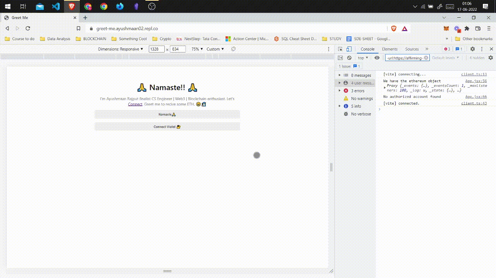

# Greet Me 🙏
## A Web3 App using Solidity
Access the React source code https://replit.com/@ayushmaan02/Greet-Me

- [x] ✅ Deployed a custom smart contract.
- [x] ✅Built a "Connect Wallet" flow.
- [x] ✅Created my own version of a web3 Jackpot!
- [x] 🌐Access it https://greet-me.ayushmaan02.repl.co


## **Demo**
*How the transction process works and How I receives the greets🚀*


<!-- # Basic Sample Hardhat Project

This project demonstrates a basic Hardhat use case. It comes with a sample contract, a test for that contract, a sample script that deploys that contract, and an example of a task implementation, which simply lists the available accounts.

Try running some of the following tasks:

```shell
npx hardhat accounts
npx hardhat compile
npx hardhat clean
npx hardhat test
npx hardhat node
node scripts/sample-script.js
npx hardhat help
``` -->
